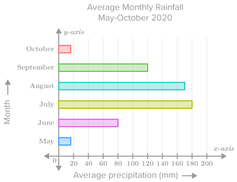
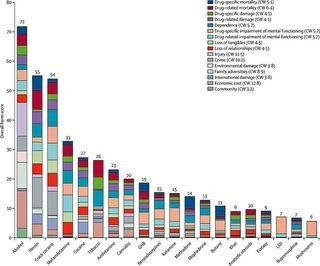

```{r setup, include=FALSE}
## **DO NOT EDIT THIS CODE CHUNK**
knitr::opts_chunk$set(echo = TRUE)

#run install.packages("cherryblossom") on the console to get the run17 dataset

library(tidyverse)
library(cherryblossom)  
```


## Exercise 1

```{r ex1a, out.width="80%"}
run17 %>%
  filter(event == "10 Mile") %>%
  ggplot(mapping = aes(x = age)) +
    geom_histogram(binwidth = 2)
```


#The average age of runners is around 30 years old
   mean_age_value <- mean(run17$age[run17$event == "10 Mile"])
    print(mean_age_value)
    
#The oldest runner is about 75
  max_age_value <- max(run17$age[run17$event == "10 Mile"])
    print(max_age_value)
  #The real ma age is 85, this shows how the graph neglects data that is less frequent
  

```{r ex1b, out.width="80%"}
run17 %>%
  filter(event == "5K") %>%
  ggplot(mapping = aes(x = age)) +
    geom_histogram(binwidth = 2)


```


#The shape of the graphs is relativley similar with a peak age of runners around the mid 30s
#There are much more runners around the ages of 10-16 in the 5K race


## Exercise 2

```{r ex2, out.width = "80%"}
net_min <- run17 %>%
  mutate(time = net_sec/60)

net_min %>%
  ggplot() +
  geom_boxplot(mapping = aes(x = time)) +
  facet_grid(vars(event),vars(sex)) +
  labs(title = "Cherryblossom Boxplots", x = "Time in minutes", y = "Percentage of Runners") +
  coord_flip()
 


```

#Male runners on average were faster in both races than female runners


## Exercise 3

```{r ex3, out.width = "80%"}
mile_data <- run17 %>%
  filter(event == "10 Mile") %>%
  mutate(start_time = clock_sec - net_sec, wave = case_when(start_time < 180 ~ "First Wave", start_time > 1380 ~ "Last Wave")) %>%
  filter(!is.na(wave))

Wave_Colours <- c("First Wave" = "orange", "Last Wave" = "Green")

mile_data %>%
  ggplot(mapping = aes(x = age, y = net_sec/60, colour = wave)) +
  geom_point(alpha = 0.5, size = 0.9) +
  geom_smooth(method = lm, se = FALSE, linewidth = 0.5) +
  scale_colour_manual(values = Wave_Colours, name = "") +
  labs(title = "Scatter Plot of 10 Mile Race, Time Against Age", 
subtitle = "First vs Last Wave",
x = "Runners Age, in Years",
y = "Race Time, in Minutes") +
  theme_minimal() + theme(legend.position = "bottom",
                          aspect.ratio = 5/6,
                          panel.border = element_rect(colour = "grey", fill = NA, 
                                                      linewidth = 1))


```


## Exercise 4

#### Example of a good data visualisation

```{r ex4_good_viz, echo = FALSE, out.width = "80%"}
# edit the file path accordingly

```


**flexibooks**, "**ck-12**" [Online]. Available at: **https://flexbooks.ck12.org/cbook/ck-12-cbse-math-class-9/section/14.3/primary/lesson/graphical-representation-of-data/** (Accessed: **02 11 2023**)


The above image presents a good data visualisation because:

-   Data is presented in an easy to read format with good labeling 
-   The color scheme of the data allows the bars to be easily differetiated


#### Example of a bad data visualisation


```{r ex4_bad_viz, echo = FALSE, out.width = "80%"}
# edit the file path accordingly

```


**Iliya Valchanov**, "**365datascience**" [Online]. Available at: **https://365datascience.com/trending/chart-types-and-how-to-select-the-right-one/** (Accessed: **02 11 2023**)


The above image presents a bad data visualisation because:

-   The data is presented in a way which makes it incredibly hard to compare the sizes of the colour in each bar on the chart
-   Too much data which is overwhelming to look at and hard to understand


