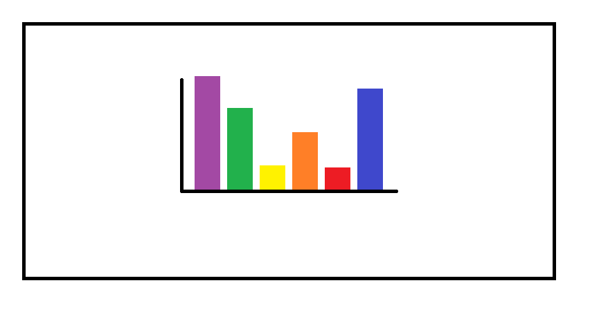

```{r setup, include=FALSE}
## **DO NOT EDIT THIS CODE CHUNK**
knitr::opts_chunk$set(echo = TRUE)

#run install.packages("cherryblossom") on the console to get the run17 dataset

library(tidyverse)
library(cherryblossom)  
```


## Exercise 1

```{r ex1a, out.width="80%"}
run17 %>%
  filter(event == "10 Mile") %>%
  ggplot(mapping = aes(x = age)) +
    geom_histogram(binwidth = 2)
```


#The average age of runners is around 30 years old
   mean_age_value <- mean(run17$age[run17$event == "10 Mile"])
    print(mean_age_value)
    
#The oldest runner is about 75
  max_age_value <- max(run17$age[run17$event == "10 Mile"])
    print(max_age_value)
  #The real ma age is 85, this shows how the graph neglects data that is less frequent
  

```{r ex1b, out.width="80%"}
run17 %>%
  filter(event == "5K") %>%
  ggplot(mapping = aes(x = age)) +
    geom_histogram(binwidth = 2)


```


#The shape of the graphs is relativley similar with a peak age of runners around the mid 30s
#There are much more runners around the ages of 10-16 in the 5K race


## Exercise 2

```{r ex2, out.width = "80%"}
net_min <- run17 %>%
  mutate(time = net_sec/60)

net_min %>%
  ggplot() +
  geom_boxplot(mapping = aes(x = time)) +
  facet_grid(vars(event),vars(sex)) +
  labs(title = "Cherryblossom Boxplots", x = "Time in minutes", y = "Percentage of Runners") +
  coord_flip()
 


```

#Male runners on average were faster in both races than female runners


## Exercise 3

```{r ex3, out.width = "80%"}
# Write your code to answer exercise 3 here


```


## Exercise 4

#### Example of a good data visualisation

```{r ex4_good_viz, echo = FALSE, out.width = "80%"}
# edit the file path accordingly

```

_Edit the text below by replacing the bold text with the appropriate information to provide a reference for your image (Please delete this message before submission!)_

**Author/Organisation**, "**Title of website**" [Online]. Available at: **URL** (Accessed: **day month year**)


The above image presents a good data visualisation because:

-   _Reason 1_
-   _Reason 2_


#### Example of a bad data visualisation


```{r ex4_bad_viz, echo = FALSE, out.width = "80%"}
# edit the file path accordingly
knitr::include_graphics("img/bad_viz.png")
```

_Edit the text below by replacing the bold text with the appropriate information to provide a reference for your image (Please delete this message before submission!)_

**Author/Organisation**, "**Title of website**" [Online]. Available at: **URL** (Accessed: **day month year**)


The above image presents a bad data visualisation because:

-   _Reason 1_
-   _Reason 2_


